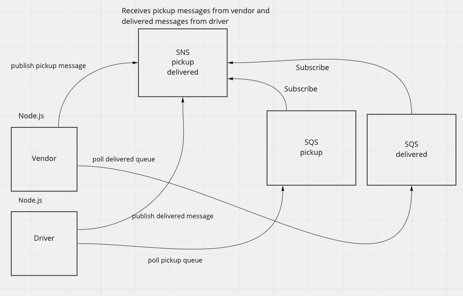

# caps-cloud

CAPS system hosted on AWS via SNS and SQS

## Technologies

- AWS SNS
- AWS SQS
- Node.js
- sqs-consumer
- nanoid

## Driver Node.js Module

- polls SQS packages-drivers.fifo queue for messages
- publishes messages to SNS delivered.fifo topic

## Vendor Node.js Module

- publishes messages to SNS pickup topic
- polls SQSmdelivered-vendors.fifo queue

## Vendor-Driver Communication

1. vendor publishes pickup message to SNS pickup.fifo topic
1. pickup.fifo sends message to SQS packages-drivers.fifo queue
1. driver recieves pickup message by polling SQS packages.fifo queue
1. upon recipt of pickup message, driver waits 5 seconds and then publishes delivered message to SNS delivered.fifo topic
1. delivered.fifo topic sends message to SQS delivered-vendors.fifo queue
1. vendor recieves delivered message by polling delivered-vendors.fifo queue

### Vendor-Driver Communication - Terminal Activity

 

## AWS SNS Topics

### pickup.fifo

### delivered.fifo

## AWS SQS Queues

### packages-drivers.fifo queue

### delivered-vendors.fifo queue

## UML

